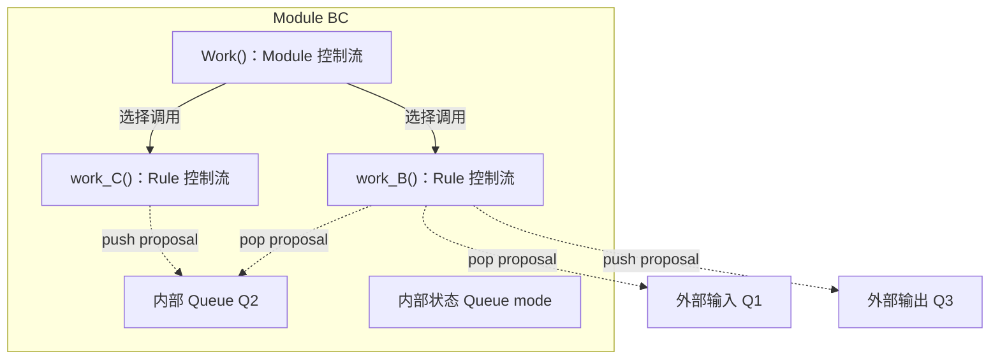
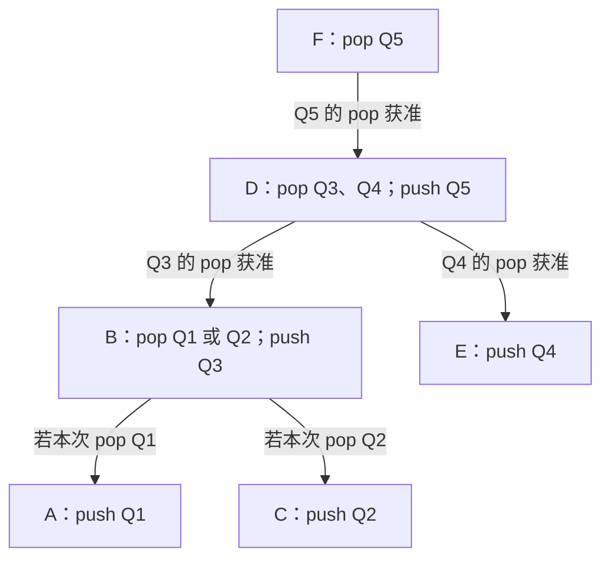
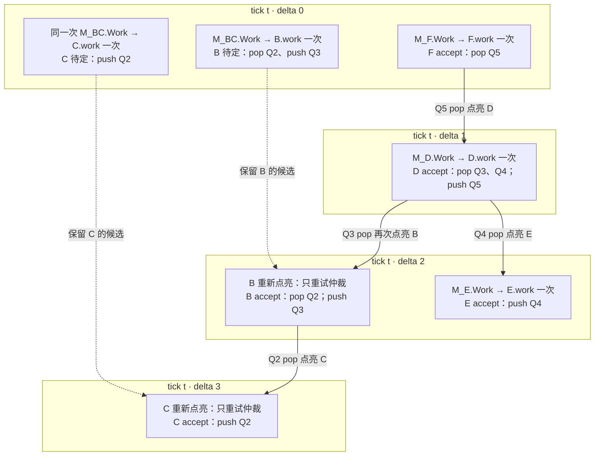

# 基于 Rule 依赖图的 tick/delta 调度

## 概述

一条 Rule 能否在本拍提交，有时取决于另一条 Rule 本拍是否获准。这是硬件中真实存在的仲裁依赖，不取决于状态用 Queue 还是寄存器表示。例如：

- **单项寄存器流水级**：`valid=1` 表示这一格已满。若下游本拍取走旧数据，上游便可在同一拍写入新数据；上游能否写入，取决于下游的取走操作是否获准。参见 [Chisel Queue 的流水选项](https://www.chisel-lang.org/api/latest/chisel3/util/Queue.html)。
- **ROB 空位**：若 ROB 已满，头部指令本拍退休可以腾出一个位置，让新指令同拍分配；分配能否获准，取决于退休是否获准。ROB 同时承担分配与退休，见 [BOOM ROB 文档](https://docs.boom-core.org/en/latest/sections/reorder-buffer.html)；这里的同拍复用是一个设计示例，不指称 BOOM 的具体容量判断。

两例依赖的都是**本拍的获准结果**，不是提前读取另一条 Rule 尚未提交的新状态。本文以 Queue 满时的 pop/push 为具体场景：按依赖顺序仲裁，使获准 pop 腾出的空间可供同拍 push 使用；状态值仍在 tick 末统一 Xfer。

## 概念基础

一个 Module 挂接输入、输出 Queue，也可以持有内部状态 Queue；Module 内部定义若干条 rule。Module 的 `Work()` 执行控制流，决定调用哪些 `work_<rule>()`。每条 rule 也可以有自己的控制流：`work_<rule>()` 沿实际选中的分支计算，并向涉及的 Queue 提出 proposal；`arbitrate_<rule>()` 决定这些 proposal 能否作为一个整体获准。

下面是伪头文件。后文依赖图中的 B、C 同属这个 Module；B 从 Q1 或 Q2 消费一个值并向 Q3 发送，C 向 Q2 发送。

```cpp
class ModuleBC : public SimObject {
public:
    Queue<Value>& q1;              // 外部输入连接
    Queue<Value>& q3;              // 外部输出连接

    ModuleBC(Queue<Value>& q1, Queue<Value>& q3);
    void Work();                   // Module 控制流，选择调用哪些 rule

    void work_B();                 // Rule B：pop q1 或 q2，push q3
    bool arbitrate_B();            // Rule B：整体仲裁

    void work_C();                 // Rule C：push q2；这里只声明
    bool arbitrate_C();            // Rule C：独立仲裁

private:
    Queue<Value> q2;               // B 与 C 之间的内部 Queue
    Queue<Mode> mode;              // 本 tick 固定的控制状态
    std::optional<Tick> lastWorkTick;
    SelectedCalls selectedCalls;  // 本 tick Work 选中的 rule 及调用参数
};
```

Q1、Q3 由外部连接，Module 保存其引用；Q2 和 mode 由 Module 持有。下面只展示 Module Work 和 Rule B Work 的控制流；Rule C 的函数体暂不展开。proposal 的具体 RuleId 由生成代码绑定，此处省略。这里 `work_C → Q2 → work_B` 形成一条数据路径。

```cpp
void ModuleBC::Work() {
    if (mode.peek() != Mode::Idle)
        work_B();                 // 选中 B；调用不代表已获准
    work_C();                     // C 也可在本 tick 独立尝试
}

void ModuleBC::work_B() {
    beginCandidateForCurrentTick(); // 旧 proposal 失效；complete = false
    if (mode.peek() == Mode::FromQ1) {
        const auto* value = q1.tryPeek();
        if (!value) return;
        q1.proposePop();
        q3.proposePush(*value);
    } else {                       // Mode::FromQ2
        const auto* value = q2.tryPeek();
        if (!value) return;
        q2.proposePop();
        q3.proposePush(*value);
    }
    markComplete();                // 候选完整，仍需 arbitrate_B()
}
```

Module Work 的 if 决定是否调用 B，C 每拍独立尝试；Rule B 的 if 决定本次消费 Q1 还是 Q2。`work_B()` 不判断 Q3 是否有空间：空间可能在后续 delta 因下游 pop 获准而变化，届时只重试缓存候选的仲裁。



图中 B 指向 Q1、Q2 的两条 pop 连线是静态可能性；一次 `work_B()` 只会选择其中一条。Rule Work 提出的操作要等对应的 `arbitrate_<rule>()` 整体获准后，才会在 tick 末提交。

## 唤醒与同 tick 的计算

Input Queue 的 push 在 tick 末通过 Xfer 提交，并在下一 tick 唤醒读取它的 Module。Module 执行 `Work()`，选择本 tick 要尝试的 rule。

Output Queue 的 pop 获准后，会在同一 tick 的下一 delta 唤醒可能向该 Queue push 的上游 rule。若上游 Module 本 tick 尚未运行，先执行一次 Module Work 和选中的 Rule Work；若候选已生成，则只重试仲裁。

同一 tick 内，所有 Work 看到的 current state 不变。因此，每个 Module 只需执行一次 `Work()`，缓存选中的 rule 路径和调用参数；每条被选中的 rule 也只需执行一次 `work_<rule>()`，以本 tick 的计算结果覆盖旧 proposal。同 tick 后续变化的是 Queue 的 push/pop 仲裁资格，而不是业务计算的结果。

## 静态图与当前 tick 的激活图

编译器预先建立并保存静态的 Rule 依赖图 `G`。图的边表示：下游 rule 的 pop 获准，可以让上游 rule 使用该 Queue 腾出的空间。边的方向是仲裁资格的传播方向，即从下游指向上游。下面的例子中，B 可能消费 Q1 或 Q2，D 同时消费 Q3 和 Q4；假设 Q1～Q5 开始时都已满，且各 rule 所需的旧数据都存在。

```text
数据流：A → Q1 ─┐
               ├→ B → Q3 ─┐
        C → Q2 ─┘          ├→ D → Q5 → F
        E → Q4 ────────────┘

Rule 仲裁依赖：F → D → B → A/C，且 D → E
```



`G` 同时保留 B→A 和 B→C 两条可能依赖；B 的 Work 根据本 tick 的 mode 只提出一个 pop，本次只有被选中 Queue 上的边会传播资格。Module 首次被唤醒并执行 Work 时，会“点亮”它选中的 Rule 节点；各 Module 的选择共同形成当前 tick 的激活子图 `G_t`。如果某个上游 Module 到后续 delta 才首次被唤醒，它执行一次 Work 后，`G_t` 才加入该 Module 选中的节点。已执行过 Work 的 Module 不改变本 tick 的选择。

每个 delta 中，被点亮的 rule 尝试仲裁。未获准的 rule 可在相关 Queue 资格变化后再次点亮，使用缓存的 proposal 重试；已获准的 rule 在本 tick 不再点亮，其 proposal 保留到 tick 末 Xfer。获准 pop 还会沿静态依赖边点亮相关的上游 rule，推动同拍仲裁继续进行。

## 点亮过程示例

假设本 tick 的 mode 为 `FromQ2`。delta 0 先唤醒 F 和 BC 所属的 Module，其余 Module 尚未执行 Work。`ModuleBC::Work()` 选中 B、C：B 的候选 pop Q2、push Q3，C 的候选 push Q2；Q3、Q2 都满，所以两者第一次仲裁未获准，候选保留，临时预约释放。随后 F 的 pop Q5 获准，沿 `G` 通知 D 所属的 Module；该 Module 首次执行 Work，点亮 D。



`G_t` 随首次执行 Work 的 Module 增加选中节点；B、C 从 delta 0 起就是已选中的待定节点，后续只获得新的仲裁机会。B 本次没有 pop Q1，因此不会沿 B→A 点亮 A。F、D、B 等节点一旦 accept，本 tick 不再点亮。各 delta 都读取相同的 current；所有获准 proposal 在 tick 末统一 Xfer。

## 调度伪代码

`take_all()` 取出并清空待处理集合；循环中新加入的对象留到下一 delta。`producers_of[queue]` 是编译期建立的静态依赖索引，但唤醒时只查询本次实际获准 pop 的 Queue。`module.work()` 内调用的每个 `work_<rule>()` 都先为当前 tick 开始一个新候选，使旧 proposal 失效；只有执行到 `markComplete()` 的候选才能仲裁。

```python
def run_tick(tick, initial_modules):
    worked_modules = set()       # 本 tick 已执行过 Work 的 Module
    accepted_rules = set()        # 本 tick 已获准的 Rule
    modules_to_work = set(initial_modules)
    rules_to_arbitrate = set()

    while modules_to_work or rules_to_arbitrate:
        # Module Work 读取固定的 current state；本 tick 每个 Module 只运行一次。
        for module in take_all(modules_to_work):
            if module in worked_modules:
                continue

            worked_modules.add(module)
            for rule in module.work():
                # 选中的 work_<rule>() 覆盖旧候选；提前退出则候选不完整。
                if rule.candidate_complete_at(tick):
                    rules_to_arbitrate.add(rule)

        # 消费者先仲裁，生产者后仲裁；pop 获准才可能给 push 腾空间。
        for rule in downstream_first(take_all(rules_to_arbitrate)):
            if rule in accepted_rules or not rule.candidate_complete_at(tick):
                continue

            if not rule.arbitrate():
                # 释放临时预约，保留本 tick 的候选，供后续 delta 重试。
                continue

            accepted_rules.add(rule)

            # 只沿本次实际获准 pop 的 Queue 传播，不遍历未选中的分支。
            for queue in rule.accepted_pops:
                for upstream in producers_of[queue]:
                    if upstream.module not in worked_modules:
                        # Module 尚未运行：先执行 Work，确定是否选中 upstream。
                        modules_to_work.add(upstream.module)
                    elif (upstream in upstream.module.selected_rules
                          and upstream.candidate_complete_at(tick)):
                        # 已有本 tick 的候选：下一 delta 只重试仲裁。
                        rules_to_arbitrate.add(upstream)

    # Xfer 只提交本 tick 已获准的 proposal，更新 Queue 的 current state。
    changed_queues = set()
    for queue in queues:
        if queue.xfer(tick):
            changed_queues.add(queue)

    # 提交后的变化在下一 tick 唤醒读取这些 Queue 的 Module。
    schedule_next_tick(changed_queues)
```

例如 B 可能 pop Q1 或 Q2，但本次仅 pop Q2，则 B 获准后只查询 `producers_of[Q2]`，点亮 C；A 不会因此被点亮。

## proposal 的跨 tick 生命周期

初版不在 tick 边界逐条清空候选，采用“本 tick 首次 Work 覆盖旧候选”的规则。`beginCandidateForCurrentTick()` 使该 rule 的旧 proposal 逻辑失效，并将 `complete` 设为 false；新提出的 Queue proposal 标记当前 tick。只有 `markComplete()` 执行后，`candidate_complete_at(tick)` 才为 true。即使 Work 提前返回，旧分支留下的 proposal 也不会参与仲裁。

- Module 本 tick 首次被激活时执行 `Work()`；被选中的 `work_<rule>()` 用当前状态重新生成候选。即使它因 `tryPeek()` 失败而没有完整候选，也要使旧候选失效。
- 同 tick 后续 delta 再激活该 rule 时，current state 未变，直接用本 tick 的候选重试仲裁。
- 候选一旦获准，便属于这一次 firing；tick 末 Xfer 后不能在下一 tick 再次仲裁。未获准的旧候选可以留在存储中，但在下一 tick 首次 Work 覆盖它之前，不具备仲裁资格。

因此，“不清空”仅指可以复用存储空间，不代表默认跨 tick 复用旧计算结果。上述调度伪代码每 tick 新建 `worked_modules` 和 `accepted_rules`，并在 Module 本 tick 首次 Work 后才把选中的 rule 加入仲裁集合。将来如果要直接复用上个 tick 未获准的候选，需要另行验证 Module 选择条件、Rule 读过的状态和 proposal 指向的元素身份都未改变；每 tick 的仲裁资格仍需重新检查。
