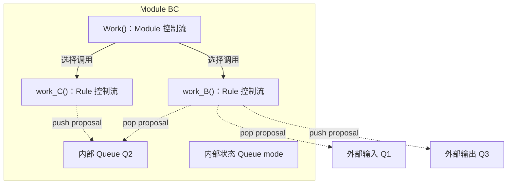
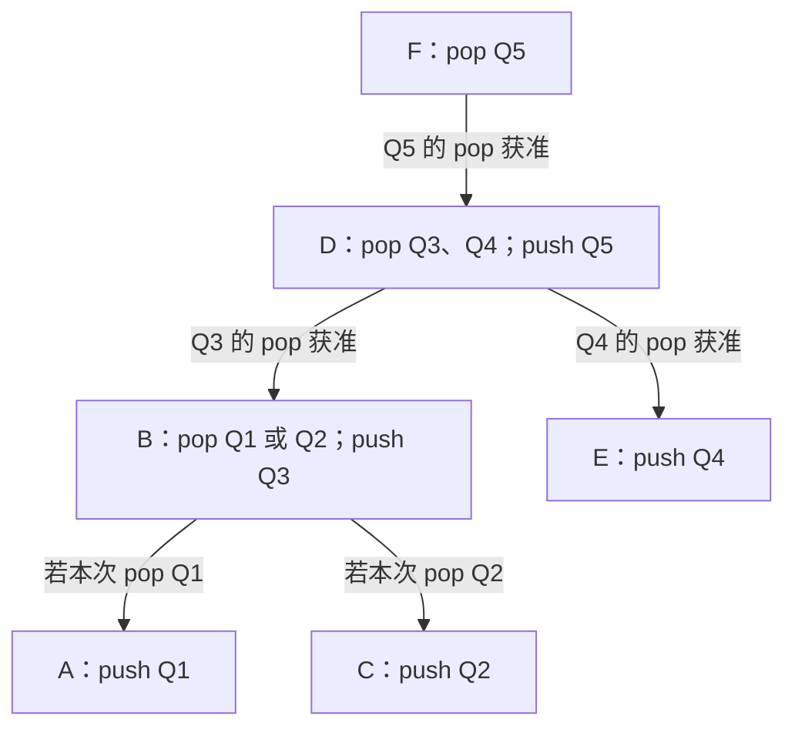
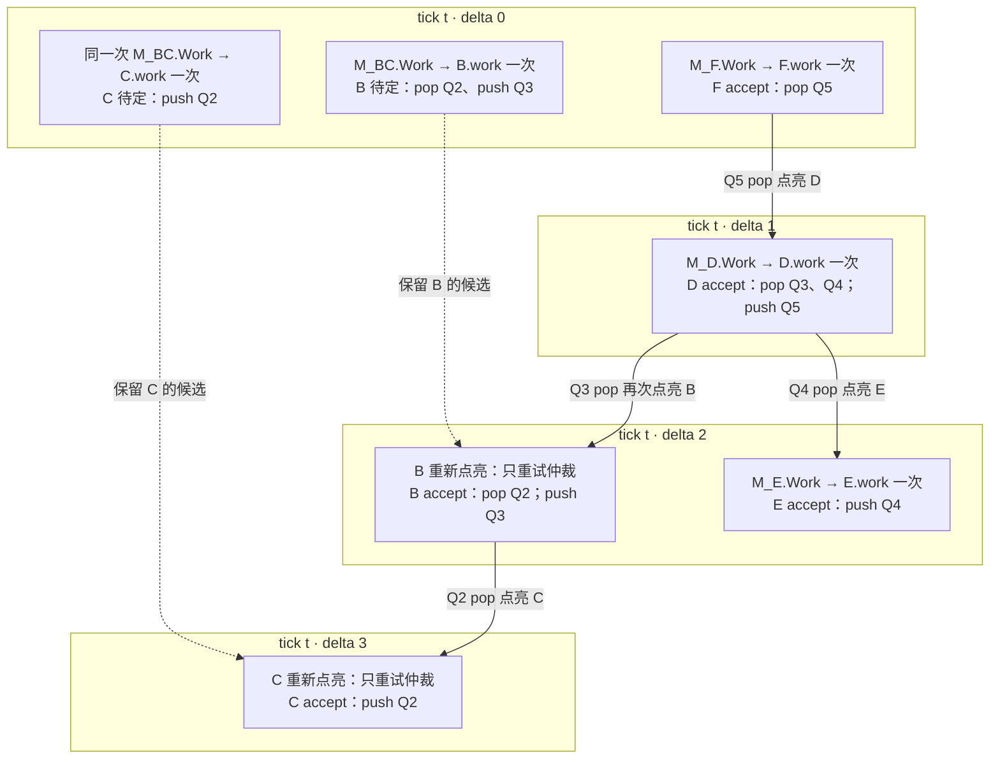

# 基于 Rule 依赖图的 tick/delta 调度

## 概述

本文按当前简化记录方案描述 B 调度，记录详见 [scheduler-records.md](scheduler-records.md)。跨 tick 由 Module 订阅激活、Rule 参数和依赖版本判断复用；同 tick 已有完整候选只重试仲裁。未写仲裁规则的端口竞争不报错、不保证获胜者。

一条 Rule 能否在本拍提交，有时取决于另一条 Rule 本拍是否获准。这是硬件中真实存在的仲裁依赖，不取决于状态用 Queue 还是寄存器表示。例如：

- **单项寄存器流水级**：`valid=1` 表示这一格已满。若下游本拍取走旧数据，上游便可在同一拍写入新数据；上游能否写入，取决于下游的取走操作是否获准。参见 [Chisel Queue 的流水选项](https://www.chisel-lang.org/api/latest/chisel3/util/Queue.html)。
- **ROB 空位**：若 ROB 已满，头部指令本拍退休可以腾出一个位置，让新指令同拍分配；分配能否获准，取决于退休是否获准。ROB 同时承担分配与退休，见 [BOOM ROB 文档](https://docs.boom-core.org/en/latest/sections/reorder-buffer.html)；这里的同拍复用是一个设计示例，不指称 BOOM 的具体容量判断。

两例依赖的都是**本拍的获准结果**，不是提前读取另一条 Rule 尚未提交的新状态。本文以 Queue 满时的 pop/push 为具体场景：按依赖顺序仲裁，使获准 pop 腾出的空间可供同拍 push 使用；状态值仍在 tick 末统一 Xfer。

## 概念基础

一个 Module 挂接输入、输出 Queue，也可以持有内部状态 Queue；Module 内部定义若干条 rule。Module 的 `Work()` 执行控制流，决定调用哪些 `work_<rule>()`。每条 rule 也可以有自己的控制流：`work_<rule>()` 沿实际选中的分支计算，并向涉及的 Queue 提出 proposal；`arbitrate_<rule>()` 决定这些 proposal 能否作为一个整体获准。

下面是伪头文件。后文依赖图中的 B、C 同属这个 Module；B 从 Q1 或 Q2 消费一个值并向 Q3 发送，C 向 Q2 发送。

```cpp
class ModuleBC : public SimObject {
public:
    Queue<Value>& q1;              // 外部输入连接
    Queue<Value>& q3;              // 外部输出连接

    ModuleBC(Queue<Value>& q1, Queue<Value>& q3);
    void Work();                   // Module 控制流，选择调用哪些 rule

    void work_B();                 // Rule B：pop q1 或 q2，push q3
    bool arbitrate_B();            // Rule B：整体仲裁

    void work_C();                 // Rule C：push q2；这里只声明
    bool arbitrate_C();            // Rule C：独立仲裁

private:
    Queue<Value> q2;               // B 与 C 之间的内部 Queue
    Queue<Mode> mode;              // 本 tick 固定的控制状态
    std::optional<Tick> lastWorkTick;
    SelectedCalls selectedCalls;  // 本 tick Work 选中的 rule 及调用参数
};
```

Q1、Q3 由外部连接，Module 保存其引用；Q2 和 mode 由 Module 持有。下面只展示 Module Work 和 Rule B Work 的控制流；Rule C 的函数体暂不展开。proposal 的具体 RuleId 由生成代码绑定，此处省略。这里 `work_C → Q2 → work_B` 形成一条数据路径。

```cpp
void ModuleBC::Work() {
    if (mode.peek() != Mode::Idle)
        work_B();                 // 选中 B；调用不代表已获准
    work_C();                     // C 也可在本 tick 独立尝试
}

void ModuleBC::work_B() {
    if (!prepareCandidateForCurrentTick())
        return; // 完整候选的参数和依赖版本匹配：复用并重新登记 Module 订阅。
    if (mode.peek() == Mode::FromQ1) {
        const auto* value = q1.tryPeek();
        if (!value) return;
        q1.proposePop();
        q3.proposePush(*value);
    } else {                       // Mode::FromQ2
        const auto* value = q2.tryPeek();
        if (!value) return;
        q2.proposePop();
        q3.proposePush(*value);
    }
    markComplete();                // 候选完整，仍需 arbitrate_B()
}
```

Module Work 的 if 决定是否调用 B，C 每拍独立尝试；Rule B 的 if 决定本次消费 Q1 还是 Q2。`work_B()` 不判断 Q3 是否有空间：空间可能在后续 delta 因下游 pop 获准而变化，届时只重试缓存候选的仲裁。



图中 B 指向 Q1、Q2 的两条 pop 连线是静态可能性；一次 `work_B()` 只会选择其中一条。Rule Work 提出的操作要等对应的 `arbitrate_<rule>()` 整体获准后，才会在 tick 末提交。

## 唤醒与同 tick 的计算

Input Queue 的 push 在 tick 末通过 Xfer 提交，并在下一 tick 唤醒读取它的 Module。Module 执行 `Work()`，选择本 tick 要尝试的 rule。

Output Queue 的 pop 获准后，会在同一 tick 的下一 delta 唤醒可能向该 Queue push 的上游 rule。若上游 Module 本 tick 尚未运行，先执行一次 Module Work 和选中的 Rule Work；若候选已生成，则只重试仲裁。

同一 tick 内，所有 Work 看到的 current state 不变。每个 Module 执行一次 `Work()`，记录选择和参数；首次选择 Rule 时检查跨 tick 候选，参数和实际依赖版本匹配则复用，否则清理旧候选后计算。后续 delta 已有完整候选直接重试仲裁，不进入 Rule Work，也不重复版本或参数比较。

## 静态图与当前 tick 的激活图

编译器预先建立并保存静态的 Rule 依赖图 `G`。图的边表示：下游 rule 的 pop 获准，可以让上游 rule 使用该 Queue 腾出的空间。边的方向是仲裁资格的传播方向，即从下游指向上游。下面的例子中，B 可能消费 Q1 或 Q2，D 同时消费 Q3 和 Q4；假设 Q1～Q5 开始时都已满，且各 rule 所需的旧数据都存在。

```text
数据流：A → Q1 ─┐
               ├→ B → Q3 ─┐
        C → Q2 ─┘          ├→ D → Q5 → F
        E → Q4 ────────────┘

Rule 仲裁依赖：F → D → B → A/C，且 D → E
```



`G` 同时保留 B→A 和 B→C 两条可能依赖；B 的 Work 根据本 tick 的 mode 只提出一个 pop，本次只有被选中 Queue 上的边会传播资格。Module 首次被唤醒并执行 Work 时，会“点亮”它选中的 Rule 节点；各 Module 的选择共同形成当前 tick 的激活子图 `G_t`。如果某个上游 Module 到后续 delta 才首次被唤醒，它执行一次 Work 后，`G_t` 才加入该 Module 选中的节点。已执行过 Work 的 Module 不改变本 tick 的选择。

每个 delta 中，被点亮的 rule 尝试仲裁。未获准的 rule 可在相关 Queue 资格变化后再次点亮，使用缓存的 proposal 重试；已获准的 rule 在本 tick 不再点亮，其 proposal 保留到 tick 末 Xfer。获准 pop 还会沿静态依赖边点亮相关的上游 rule，推动同拍仲裁继续进行。

## 点亮过程示例

假设本 tick 的 mode 为 `FromQ2`。delta 0 先唤醒 F 和 BC 所属的 Module，其余 Module 尚未执行 Work。`ModuleBC::Work()` 选中 B、C：B 的候选 pop Q2、push Q3，C 的候选 push Q2；Q3、Q2 都满，所以两者第一次仲裁未获准，候选保留，临时预约释放。随后 F 的 pop Q5 获准，沿 `G` 通知 D 所属的 Module；该 Module 首次执行 Work，点亮 D。



`G_t` 随首次执行 Work 的 Module 增加选中节点；B、C 从 delta 0 起就是已选中的待定节点，后续只获得新的仲裁机会。B 本次没有 pop Q1，因此不会沿 B→A 点亮 A。F、D、B 等节点一旦 accept，本 tick 不再点亮。各 delta 都读取相同的 current；所有获准 proposal 在 tick 末统一 Xfer。

## 调度伪代码

任务以 ID 列表和入队标记去重；take_all 取当前批次，循环中新增任务留到下一 delta。run_module_once 包含 Module 选择、候选验证或计算、订阅发布和旧候选取消，不分析函数体。

```python
def run_tick(tick, initial_modules):
    module_tasks.enqueue_all(initial_modules)
    accepted = []
    while module_tasks or rule_tasks:
        batch_modules = module_tasks.take_all()
        batch_rules = rule_tasks.take_all()
        for mid in batch_modules:
            if modules[mid].worked_tick != tick:
                run_module_once(mid, tick)
                batch_rules.enqueue_all(modules[mid].selected_rules)

        for rid in downstream_first(batch_rules):
            r = rules[rid]
            if r.selected_tick != tick or r.accepted_tick == tick:
                continue
            if not r.complete or not r.participants:
                continue
            if not arbitrate(rid):
                # 释放全部临时预约，保留候选，保存第一个 waiting_queue。
                continue
            accepted.append(rid)
            for qid in actual_accepted_pops(rid):
                for upstream in producers_of[qid]:
                    m, r = owner_module(upstream), rules[upstream]
                    if m.worked_tick != tick:
                        module_tasks.enqueue(m.id)
                    elif (r.selected_tick == tick and r.complete and r.participants
                          and r.accepted_tick != tick and upstream not in batch_rules):
                        rule_tasks.enqueue(upstream)  # 直接仲裁，不调用 Work

    changed = xfer_all_used_queues()  # revise → pop → push；仅清理 accepted
    for qid in changed:
        for mid, saved_gen in readers_of[qid]:
            if saved_gen == modules[mid].read_gen:
                next_tick_modules.enqueue(mid)
    for qid in used_queues:
        for rid in sources_of[qid]:
            if rules[rid].waiting_queue == qid:
                next_tick_modules.enqueue(owner_module(rid).id)
    clear_committed_candidates(accepted)
```

只查询实际获准 pop 的 Queue，未选中的静态分支不传播。已在当前批次中的生产者按消费先行顺序稍后检查容量，不重复安排下一 delta。

## 跨 tick 候选和读取关系

Module Work 开始准备新读取代号；实际读取及复用 Rule.deps 都登记 Queue 的 Module 读者条目；结束后发布 readGen。旧条目代号不匹配则失效。读空也登记，子 Module 的读取登记到自己名下。

Rule 保存实际读取 Queue 的版本及 pop/revise 目标版本。纯 push 不依赖输出旧内容。只有完整且有 proposal 的未获准候选，在参数和所有依赖版本匹配时才复用。Module 未选中的旧 Rule 取消；必要读取失败清理部分 proposal，但保留 Module 订阅。

完整仲裁失败只释放预约，候选可跨 tick 保留；获准候选在 Xfer 后清空，不能下一 tick 再次提交。无变化 revise 不推进版本，但端口重置仍通知 waiting_queue 匹配的 Rule 所属 Module。

不增加 Rule.ruleGen、dirty 或 Queue 的 Rule 读者／等待者表。Rule 只保存单个 waiting_queue；端口重置按静态 sources 筛选，不扫描全部 Rule。静态 sources 包含所有可能修改操作，不限于 push。

同 tick 重试只调用仲裁入口，不重新 Work。静态容量环、公平性、最大获准集合及其他未扩展边界仍见 [schedule.md](schedule.md)。
