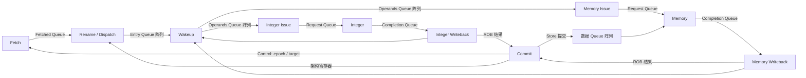

# 小型乱序 RV32 CPU

这个示例通过现有 **ACPy → ACIR → C++ → GFSim** 编译链执行汇编程序。
8 项 ROB 和 8 项保留站，单取指／分配／提交，整数和访存各选最老就绪指令，
每拍最多发射两条。所有 CPU 行为来自 ACPy；C++ 只装载、观察、判断结束和计时。

## 构建与运行

从仓库根目录运行，需要 Python 3.10+、C++20 和 CMake 3.20+：

```bash
cmake -S pycircuit -B /tmp/acpy-ooo-build -DCMAKE_BUILD_TYPE=Release
cmake --build /tmp/acpy-ooo-build -j4
python3 pycircuit/examples/ooo/run.py pycircuit/examples/ooo/programs/latency.s \
  --runner /tmp/acpy-ooo-build/examples/ooo/acpy-ooo-compiled
ctest --test-dir /tmp/acpy-ooo-build --output-on-failure
```

`run.py` 使用已有 Ripes5 汇编器，逐条对照独立顺序解释器，保存 JSONL 轨迹和
摘要到 `output/custom/`。默认 x31=4096，其他寄存器为零；数据区为 64 个字，
初值 `[7, 23, 2, 3, ..., 63]`。可通过 `--data` 和 `--registers` 提供 JSON 数组。
使用 `--reverse` 切换 Module 注册顺序。支持 ADD/ADDI/SUB/AND/OR/XOR/SLT、
LUI、LW/SW、BEQ/BNE、JAL/JALR 及 `halt`（0x00100073）；JALR 清除目标地址 bit 0。

模型构造一次即可运行不同程序。`halt` 只有到达提交头才终止；取指错误、非法指令
和访存错误分别以 fault 1/2/3 在提交时停止，无 trap/CSR/中断。错误路径上的错误
可以执行、完成，但不能产生架构副作用。程序应在给定周期上限内到达 halt 或精确错误。

构建产物都在构建目录。`compiled/` 直接编译 ACPy，`emitted/` 仅从已保存的 ACIR
重新生成 C++，两个模型使用相同、未修改的 GFSim。也可以直接调用：

```bash
python3 -m pycircuit compile pycircuit/examples/ooo/model.py \
  --top CPU --output /tmp/ooo-compiled
python3 -m pycircuit emit /tmp/ooo-compiled/model.acir.mlir --output /tmp/ooo-emitted
ctest --test-dir /tmp/acpy-ooo-build -R acpy-ooo --output-on-failure
```

## 连接与阅读顺序



阅读顺序：

1. [model.py](model.py)：固定资源、Signal 和 Module 连接。
2. [types.py](types.py)：消息、状态和纯计算；复用现有 ACPy 译码器。
3. [frontend.py](frontend.py)：取指、满窗口判断、重命名和分配。
4. [issue.py](issue.py)：独立唤醒，以及分别绑定两路的最老就绪 Signal／Issue Module。
5. [execute.py](execute.py)：整数、三拍非流水访存和两路写回。
6. [commit.py](commit.py)：顺序提交、架构副作用、终止和分支恢复。
7. [reference.py](reference.py)、[verify.py](verify.py)：独立指令译码／解释器及轨迹约束。

所有 Signal 只读 Queue。整数与访存选择器共享同一个 Signal 定义，但各自绑定
不同的发射标记阵列。每个扫描范围均固定为 8，展开成组合判断；没有宿主扫描调度。

## 状态写入方

| Queue / 状态 | 唯一写入 Rule | 用途 |
| --- | --- | --- |
| front、取指输出 | Fetch.fetch | 预测顺序 PC、缓冲已取指令 |
| tail、entries[8]、rename[32] | Dispatch.dispatch | 分配及重命名元数据 |
| operands[8] | Wakeup.wake | 锁存源值，或保留待完成生产者 tag |
| int_issued[8]、整数请求 | 整数 Issue.issue | 请求 push 与发射标记原子提交 |
| mem_issued[8]、访存请求 | 访存 Issue.issue | 同上 |
| 整数完成输出 | Integer.execute | 一拍计算 |
| pending、访存完成输出 | Memory.execute | 一个活动操作，三拍执行 |
| int_results[8] | 整数 Writeback.writeback | 整数完成结果及广播 |
| mem_results[8] | 访存 Writeback.writeback | 访存完成结果及广播 |
| control、registers[32]、data、retirement、flush | Commit.commit | 唯一架构副作用和恢复点 |
| clock | Clock.tick | 周期观测及可选反压测试端口 |

每个状态 Queue 容量为 1，使用 revise；五个消息 Queue 容量也均为 1，使用 push/pop。
ROB 和保留站一一对应，槽位为 `(sequence - 1) % 8`。

源操作数在分配时从架构寄存器或最新重命名生产者获取。尚未完成时保存生产者
`(epoch, sequence)`，完成后由 Wakeup 锁存，不再依赖生产者槽位。
提交不会误清除后来的 WAW 映射；WAR 的旧源值／tag 不随新映射改变，x0 永远为零。

## 周期与恢复

所有组件读当前拍状态，获准的 Queue 操作在拍末可见。无等待时：

| 行为 | 相对于请求 push 的周期 |
| --- | --- |
| 请求写入 Queue／标记发射 | T |
| 整数计算并 push 完成 | T+1 |
| 整数写回 ROB | T+2 |
| 最早整数提交 | T+3 |
| 访存接收并计算地址／读取数据 | T+1 |
| 访存等待 | T+2 |
| 访存 push 完成 | T+3 |
| 访存写回 ROB | T+4 |
| 最早访存提交 | T+5 |

访存只保持一个活动操作，另有一项请求缓冲；完成输出阻塞时保持 pending，
直到 push 获准。整数请求同样在输出阻塞时保留。唤醒独立于两路执行反压，
已捕获的操作数不因生产者提交或槽位复用而失效。

Store 在执行时仅算地址和记录值，提交时才写内存。Load 必须等所有更老 Store
提交，既无访存推测也无 Store 转发。整数和访存可同拍写回不同的结果阵列。

分支／跳转实际目标不同于顺序预测时，在提交拍递增 epoch 并重置 head=1。
下一拍各组件看到新代号，旧元数据和重命名项逻辑失效；Fetch 转向新 PC，Dispatch
重新开始编号。旧请求与完成消息继续按正常 Queue 规则排空，旧 pending 被丢弃。
提交重定向同拍允许其他组件产生旧代号消息，它们不能成为新 ROB 的结果。
恢复使用架构寄存器，不需要回滚重命名表或多写入方清空阵列。

`--wb-period N --wb-closed K` 是验证用静态配置：在周期余数小于 K 时暂停写回接收，
形成真实 Queue 反压。正常配置 N=K=0；该端口只控制接收，宿主不干预 CPU 状态。

## 验收与证据

16 个汇编程序加 4 个反压重跑，共 20 场景。每个场景运行 Module 正反序，
再在 ACIR 独立重载模型上重复，共 80 次。固定种子混合程序保存为 `.s`，
生成器同时校验文件与种子一致，避免测试时悄悄改变输入。

逐条比较提交 PC、指令、寄存器写入和 Store，并逐拍比较架构寄存器和内存。
此外检查最老就绪选择、一次发射／完成、提交顺序、两路执行周期、非流水访存、
反压下的候选保留及操作数保持；显式要求乱序、双发射、满窗口、错误路径访存错误、
带在途消息清空和多次槽位复用确实发生。四配置的完整模型轨迹必须逐拍一致。
失败时 `*.mismatch.json` 保存首个差异前后周期和参考提交上下文。

[results.json](results.json) 和 [report.md](report.md) 记录历史验收、代码量及回归结果；当前静态调度验收见 [GFSim 报告](../../../gfsim/cpp/report.md)。
[timing.json](timing.json) 保存固定 CPU、一次预热和七次轮换采样。
完整输入、逐拍轨迹及回归日志在忽略版本管理的 `output/` 目录。
已发现的前端限制和最小复现见 [findings.md](findings.md)。

[performance.json](performance.json) 保存原生成器的长程序热点分析。
[performance-input-checks.json](performance-input-checks.json) 单独记录编译器改为显式检查必要输入后的对照：
GFSim 实现和 CPU 模型不变，160 条完整轨迹与修改前一致；137,906 拍长程序仍有
107,987 次 Rule 中止，正常缺输入的 `NeedInput` 抛出次数为零。同核七次交替采样，
缓存开启时每拍中位耗时由 10.47 μs 降至 6.47 μs，吞吐约为原来的 1.62 倍。
生成契约见 [编译器说明](../../README.md#前端范式)；历史测量文件保留原指纹与口径。

```bash
python3 pycircuit/examples/ooo/bench.py \
  --compiled /tmp/acpy-ooo-build/examples/ooo/acpy-ooo-compiled \
  --emitted /tmp/acpy-ooo-build/examples/ooo/acpy-ooo-emitted
```
