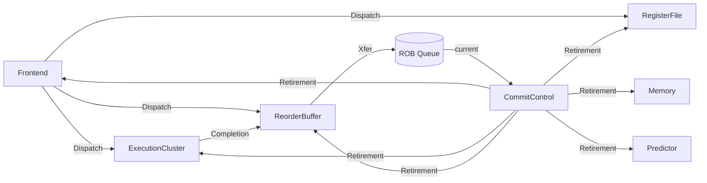

# 与原生 skyzh 逐拍对齐的 ACPy CPU

[model.py](model.py) 用 Queue 保存状态与槽位占用，Signal 表达译码、分派、执行广播和提交控制，23 个独立 Module 分别更新自己拥有的状态。全部硬件行为由 ACPy 经 MLIR 生成；测试 runner 只装载程序、驱动和观察。

目标参考是未修改的 skyzh `out-of-order` 提交 `8989a09c357a69b68612f653380d60816f5176c2`。本例保留该版本的微架构行为及已知错误，因此**参考逐拍一致与 RV32I 正确是两项独立检查**，见 [分析记录](docs/findings.md)。

## 目录与结构

按硬件组件组织：组件文件同时包含自己的组合计算和状态更新。顶层先声明固定 Queue，再连接组件；组件通过 `return` 导出内部 Signal 的固定引用。

| 文件 | 职责 |
| --- | --- |
| [model.py](model.py) | CPU 资源声明及组件连接；对外共享 `allocation`、`completion`、`retirement` 三类 Signal |
| [frontend.py](frontend.py) | 取指、源操作数、资源选择、分派和 PC 更新；导出 `Dispatch` |
| [execution.py](execution.py) | ALU/LSU 计算、保留站分配与释放、操作数广播；导出 `Completion` |
| [reorder_buffer.py](reorder_buffer.py) | ROB entry 分配、结果／Store 地址更新、退役／flush 与环形指针 |
| [commit.py](commit.py) | 从旧 ROB head 决定提交、跳转和恢复；导出 `Retirement` |
| [register_file.py](register_file.py) | RF/RAT 更新，处理同拍重命名与提交的优先关系 |
| [memory.py](memory.py)、[predictor.py](predictor.py) | 提交时写内存、训练预测器 |
| [types.py](types.py)、[logic.py](logic.py) | 公共状态／端口类型，以及纯译码、定宽 ALU、分支判断函数 |
| [tests/](tests/)、[tools/](tools/) | 端到端逐拍验收、独立 ISA 检查和 benchmark |
| [docs/](docs/) | 模型边界、表达问题与性能记录 |

建议从 `model.py` 看连线，再依次阅读 Frontend → ExecutionCluster → ReorderBuffer → CommitControl，最后查看寄存器、内存和预测器更新。



图中的组合连线不增加流水拍。PC、RS、LSU 阶段、RF/RAT、内存和预测器也通过各自 Queue 保存跨拍状态；这些固定资源在顶层声明，传给负责更新和观察的组件。ROB 是 8 个容量 1 的 Queue，环形 head/tail 保留一格，可用 7 项；10 个保留站也各有容量 1 的 Queue。

| 公共 Signal | 主要字段与使用者 |
| --- | --- |
| `Dispatch` | 最多两个分配请求（站号、ROB tag、待写 RS／ROB payload）、重命名信息、下一 PC／tail；执行簇、ROB、RF/RAT 使用 |
| `Completion` | 10 路完成标志、ROB tag、结果，以及 Store 地址更新标志／地址；ROB 和执行簇内部操作数广播使用 |
| `Retirement` | 旧 head 的提交条目、RF／Store／预测器更新标志、flush 及目标 PC；各状态组件使用 |

取指和全部源操作数视图是 Frontend 内部 Signal；ALU 结果和 LSU 推进信息是 ExecutionCluster 内部 Signal。LSU 的 `advance`、`phase`、`buffer` 不通过公共完成总线传播。组件分组保留 23 个独立状态更新 Module 和 7 个 Signal，ROB／保留站每槽仍有独立 Rule；CommitControl 只导出组合 Signal，没有状态提交 Rule。

内存和预测器均与参考同规模：4 MiB 内存、4 MiB 历史字节、4 MiB 计数器，按 256 字节地址页组织 Queue；运行时扫描保留为循环。

Signal 链在初始化和 Queue Xfer 后按静态拓扑序计算，不增加流水拍。每拍只使用旧占用/ready 状态选择分派、执行和提交：

- 当拍释放的 ROB/保留站不能立即再分配；当拍新完成的 ROB 下一拍才能提交。
- 广播同时唤醒已有条目和当拍新分派条目；新就绪操作数下一拍才能执行。
- 同拍重命名与提交写同一寄存器时，先考虑新 tag，再决定是否清除 RAT Busy。
- Load 分为地址、读内存、完成三个阶段；Store 分为地址、数据完成两个阶段。
- 分支误预测和 JALR 在提交拍恢复，一次 Xfer 清空各 entry Queue 并复位指针/LSU 阶段，覆盖当拍分派。
- JALR 原子占用两个 ALU 站和两个 ROB 项，分别计算链接值与目标地址。

## 构建与验收

需要 [编译器工具链](../../README.md) 和固定原生参考；以下命令从仓库根目录执行。已有参考仓库时跳过 clone。

```bash
git clone --branch out-of-order https://github.com/skyzh/RISCV-Simulator.git reference/skyzh-riscv-reference
git -C reference/skyzh-riscv-reference checkout 8989a09c357a69b68612f653380d60816f5176c2
export LD_LIBRARY_PATH=/home/lc/opt/gcc14/lib${LD_LIBRARY_PATH:+:$LD_LIBRARY_PATH}
cmake -S pycircuit -B reference/builds/acpy-release -DCMAKE_BUILD_TYPE=Release \
  -DCMAKE_C_COMPILER=/home/lc/opt/pycircuit-dev/bin/cc \
  -DCMAKE_CXX_COMPILER=/home/lc/opt/pycircuit-dev/bin/c++ \
  -DMLIR_DIR=/home/lc/opt/llvm-22.1.8/lib/cmake/mlir
cmake --build reference/builds/acpy-release -j6
ctest --test-dir reference/builds/acpy-release --output-on-failure -j4
```

CMake 构建原生适配器并检查参考版本和工作区未修改；可用 `-DSKYZH_REFERENCE_SOURCE=/path/to/checkout` 指定位置。单独运行 CPU 验收：

```bash
python3 -m pycircuit.examples.skyzh_ooo.tests.verify \
  --compiled reference/builds/acpy-release/examples/skyzh_ooo/acpy-skyzh-compiled \
  --emitted reference/builds/acpy-release/examples/skyzh_ooo/acpy-skyzh-emitted \
  --no-opt reference/builds/acpy-release/examples/skyzh_ooo/acpy-skyzh-noopt \
  --reference reference/builds/acpy-release/examples/skyzh_ooo/reference/skyzh-reference \
  --output reference/benchmarks/skyzh-alignment/check
```

每个程序比较直接编译、MLIR 重载、关闭优化三版及 Module 正反序，共 42 次生成模型运行。逐拍核对 PC、ROB 指针和占用、有效 ROB/RS 字段、RAT、RF、LSU 阶段、程序范围内预测器与每条提交；最终核对全部内存变化和完整预测器哈希。空槽和未就绪值等无效字段归零后比较。原生适配始终调用 `Session::tick()`，没有复刻其调度。

正常程序另逐条提交对照独立 RV32I 解释器；三个已知错误程序要求复现参考偏差，避免误报 ISA 通过。覆盖断言包括 ROB 满、同拍多路完成、槽位复用、Load 三阶段、JALR 双分派、分派/提交重命名冲突、分派旁路和在途 flush。

| 程序 | ACPy / 原生周期 | 独立 ISA |
| --- | ---: | --- |
| alignment | 83 / 83 | 通过 |
| full_window | 29 / 29 | 通过 |
| window | 671 / 671 | 通过 |
| branches | 136 / 136 | 通过 |
| integer | 27 / 27 | 预期复现 SRAI 错误 |
| memory | 23 / 23 | 预期复现 LB / 重叠访存错误 |
| auipc | 40 / 40（固定观察窗口） | 预期停滞，未完成程序 |

CTest 完整输出可用 `--output-junit ctest.xml` 保存在构建目录；CPU 轨迹和摘要在该构建的 `examples/skyzh_ooo/evidence/`。Sanitizer 构建命令见 [编译器说明](../../README.md)。

## 性能比较

```bash
python3 -m pycircuit.examples.skyzh_ooo.tools.benchmark \
  --generated reference/builds/acpy-release/examples/skyzh_ooo/acpy-skyzh-compiled \
  --reference reference/builds/acpy-release/examples/skyzh_ooo/reference/skyzh-reference \
  --output reference/benchmarks/skyzh-aligned --repeats 7 --iterations 4096
```

仅使用两边都通过 ISA 检查的 window/branches。先比较扩展程序完整逐拍轨迹，再计时同一固定 N 次 `step()/tick()`。两边统一 Clang 22、C++20、`-O3 -DNDEBUG`，绑定同一 CPU，各预热一个进程，然后串行交替七轮。构造、装载、停止检查、快照和 JSON 均在计时外；GFSim 首次 Signal 初始化计入。报告周期、IPC、ns/tick、架构指令/秒及七轮原始样本，构造耗时和进程峰值 RSS 另列。

测量结果写入 `reference/benchmarks/skyzh-aligned/results.json`，包含源码/二进制指纹和编译参数。旧 CPU 的流水、ROB 容量和内存配置不同，其性能数字不能直接当成本次模型的前后优化比。

**时序对齐：**7 个短程序 × 3 种生成方式 × 2 种 Module 顺序，共 42 次运行逐拍一致；下面两个长程序的完整逐拍状态和架构提交也与原生一致，并通过独立 RV32I 检查。AUIPC、SRAI、LB 等参考已知错误仍按上面的验收表单独记录。

**运行速度：**2026-10-04，aarch64 CPU 0，Clang 22.1.8、`-O3 -DNDEBUG`、无 LTO；每个程序循环 4096 次，串行交替七轮取中位数。ns/tick 越低越快，耗时倍数为 ACPy / 原生：

| 程序 | 两边共同周期 | 共同 IPC | ACPy ns/tick | 原生 ns/tick | 耗时倍数 |
| --- | ---: | ---: | ---: | ---: | ---: |
| window | 40,991 | 0.9994 | 14,662.3 | 297.6 | 49.26× |
| branches | 12,328 | 0.9979 | 13,315.8 | 316.8 | 42.03× |

2026-10-04 的生成模型模拟耗时约为原生的 **42–49 倍**，两边模拟周期数相同。构造、装载及轨迹输出不在计时范围内；原始样本、源码指纹和额外指标保存在本地 `reference/benchmarks/skyzh-aligned/results.json`，测量产物不纳入 Git。

后续采样与 A/B 实验已记录在 [性能问题记录](docs/findings.md#performance-findings)：生成 C++ 的多余清零／聚合值拷贝和无变化 revise 是已确认的优化项。实验合并后耗时下降约 59%–61%，仍保留 17–19 倍差距；这些修改尚未应用到正式实现。

旧模型和实验已归档到 `reference/benchmarks/skyzh-before-alignment/`；通用表达探针移到 [编译器 fixtures](../../tests/fixtures/skyzh/)。示例目录只保留当前模型、验收及 benchmark 入口。

## 可读性重构测量（2026-10-05）

按上述组件结构整理前后，在同一工具链、同一 CPU 上各运行七轮，window/branches 均循环 4096 次。沿用前述逐拍验证和计时方法；本次同时缩小公共完成总线，LSU 阶段信息保留在执行簇内部。

| 程序 | 重构前 ns/tick | 重构后 ns/tick | 每拍耗时下降 |
| --- | ---: | ---: | ---: |
| window | 14,764.0 | 13,487.2 | 8.6% |
| branches | 13,319.3 | 12,216.5 | 8.3% |

构造耗时前后约 86 ms，进程峰值 RSS 前后约 66.6 MiB。重构后的七个短程序 × 三种生成方式 × 两种 Module 顺序共 42 次逐拍对照通过；两个长程序分别为 40,991／12,328 拍，也与原生逐拍一致并通过独立 ISA 检查。编译器和 GFSim 调度引擎沿用现有实现。

本地证据在 [`reference/benchmarks/skyzh-readability/`](../../../reference/benchmarks/skyzh-readability/)：`baseline-validation/`、`hierarchy-validation/`、`final-validation/` 保存迁移前、中、后的轨迹，`baseline/`、`after/` 保存七轮测量和长程序验收，`comparison.json` 汇总变化。测量产物不纳入 Git。
