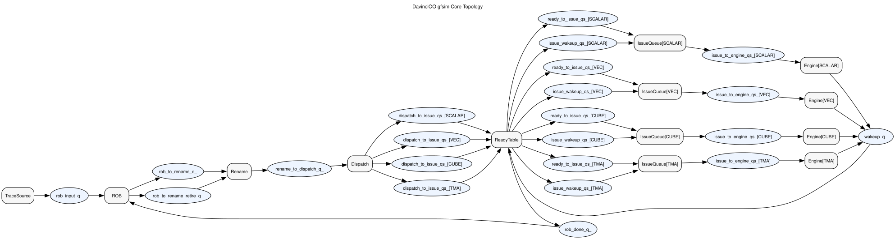

# Core

This document describes the top-level model topology implemented in:

- [core.hpp](./core.hpp)
- [core.cpp](./core.cpp)

## Schematic

Source:
- [core_topology.dot](../../docs/diagrams/core_topology.dot)

Rendered SVG:

## Purpose

`Core` is the parent topology owner for the current basic Davinci model top.

It owns:

- frontend trace source
- ROB
- rename
- dispatch
- ready table
- distributed issue queues
- engine modules
- all physical interconnect queue storage between those modules

## Inputs

`Core` has no boundary `SimQueue` inputs.

Instead, the host loads the trace instruction vector through:

- `LoadTrace(std::vector<PTOInst>)`

## Outputs

`Core` has no boundary `SimQueue` outputs.

Externally visible results are queried through:

- processed instruction log
- ROB capacity / occupancy
- engine counts

## Inner State / Private Queues

Owned queues:

- `rob_input_q_`
- `rob_to_rename_q_`
- `rob_to_rename_retire_q_`
- `rename_to_dispatch_q_`
- `dispatch_to_issue_qs_[]`
- `ready_to_issue_qs_[]`
- `issue_wakeup_qs_[]`
- `issue_to_engine_qs_[]`
- `wakeup_q_`
- `rob_done_q_`

Owned child modules:

- `TraceSourceModule frontend_`
- `ROB rob_`
- `Rename rename_`
- `Dispatch dispatch_`
- `ReadyTable ready_table_`
- `IssueQueue` arrays for `VEC`, `CUBE`, and `TMA`
- `IssueQueue` arrays for `SCALAR`, `VEC`, `CUBE`, and `TMA`
- `Engine` arrays for `SCALAR`, `VEC`, `CUBE`, and `TMA`

## Owned Storage

`Core` is the physical owner of all interconnect queue storage between child
modules.

Children only receive queue pointers via binding.

## Features

- reads typed PTO instructions from the frontend source
- blocks frontend fetch when the ROB is full
- allocates ROB entries in order
- renames local tile operands through SMAP and a tile-tag free list
- routes issued instructions through dispatch
- initializes source readiness from the ready table
- holds non-ready instructions in distributed issue queues
- routes work to `SCALAR`, `VEC`, `CUBE`, and `TMA` engine families only when ready
- routes engine completions into a wakeup queue, then through ready-table
  broadcast back to issue queues and ROB
- drains until frontend is empty, queues are empty, ROB is empty, and engines are idle

## Cycle Behavior

Per cycle:

1. if ROB is not full, allow frontend to emit one instruction
2. advance frontend-to-ROB queue
3. run ROB
4. advance ROB-to-rename issue and retire queues
5. run rename
6. advance rename-to-dispatch queue
7. run dispatch
8. advance dispatch-routed queues
9. advance global wakeup queue from the previous cycle
10. run ready table / wakeup broadcast
11. advance ready-table outputs into distributed issue queues
12. run distributed issue queues
13. advance issue-to-engine queues
14. run all engines

## PTOInstRef Pop/Update/Push Rule

`Core` does not itself mutate per-instruction runtime state. Its job is to own
the queues and tick the stage owners in a stable order so those stage-local
updates happen at the correct place:

- ROB owns alloc / retire-side updates
- Rename owns tile-tag / SMAP updates
- Dispatch owns dispatch-side updates
- ReadyTable owns global tile-tag readiness outside IQ residency
- IssueQueue owns resident per-input valid/ready state and pick
- Engine owns execution-side updates

## Limitations / Simplifications

- single-width frontend fetch into ROB
- single-width ROB issue to dispatch
- simple queue-order scheduling
- no flush / redirect / replay / recovery control
- ready state is still a simplified tile-tag model rather than a full LinxCore speculative scoreboard
